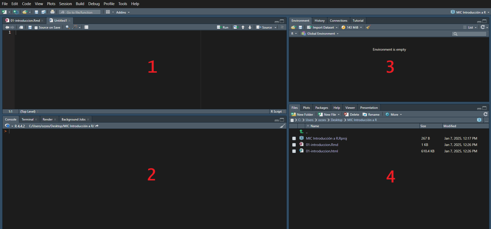
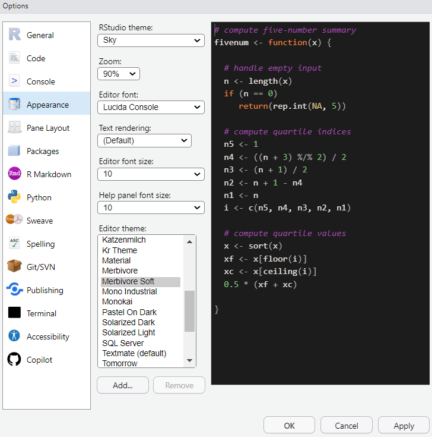
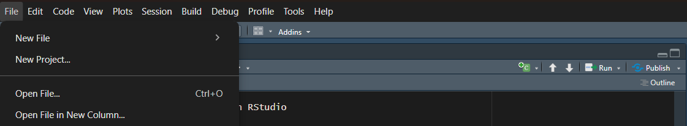
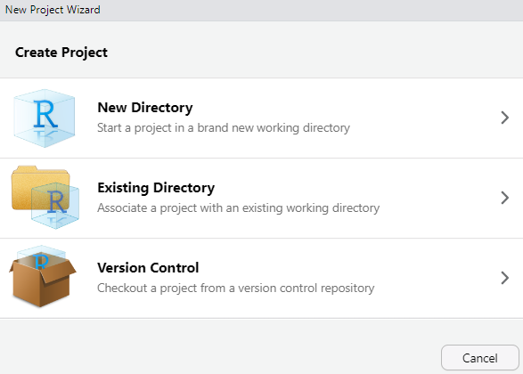
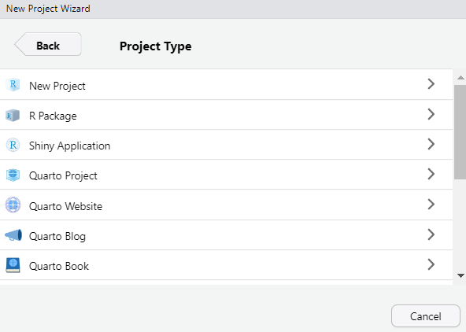
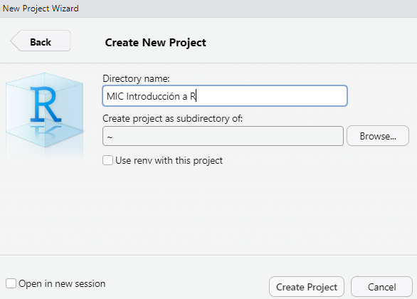
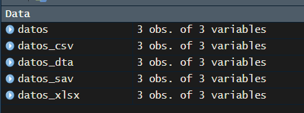

---
title: "01 | Introducción a R y RStudio"
subtitle: "Primeros pasos para análisis reproducible en salud"
---

# Introducción a R y RStudio

Este capítulo abre el manual. Presenta el entorno de trabajo, la lógica de los proyectos reproducibles y las primeras operaciones que harán posible todo lo demás.


R es una herramienta gratuita y poderosa para analizar datos y crear gráficos de alta calidad. Es ampliamente utilizada para realizar distintos tipos de análisis estadísticos, como construir modelos predictivos, identificar patrones en los datos y clasificar información. Su flexibilidad y personalización la hacen ideal tanto para principiantes como para expertos. Una de sus mayores ventajas es la capacidad de generar gráficos profesionales, que incluso pueden incluir fórmulas matemáticas. Además, R es compatible con los principales sistemas operativos, como Linux, Windows y MacOS [1].

Para aprovechar al máximo las capacidades de R, existe RStudio, un entorno de desarrollo integrado (IDE) que también admite Python. RStudio facilita la escritura y ejecución de código al incluir herramientas como una consola, un editor con resaltado de sintaxis, funciones para crear gráficos, gestionar el historial, depurar errores y organizar proyectos. Está disponible en versiones gratuitas y comerciales, y funciona en Windows, Mac y Linux, proporcionando una plataforma cómoda y eficiente para desarrollar proyectos de análisis de datos [2].

---

## Instalación de R y RStudio

### Pasos:
1. Descarga R (versión 4.4.3) desde el sitio oficial [R Project](https://www.r-project.org/) según su sistema operativo:
  - Para [Windows](https://cran.r-project.org/bin/windows/base/)
  - Para [macOS](https://cran.r-project.org/bin/macosx/)
  - Para [Linux](https://cloud.r-project.org/bin/linux/)

2. Descarga RStudio desde: [Posit](https://posit.co/download/rstudio-desktop/)

Ambos son software libre y no requieren pagos para su descarga ni uso.


---

## Ambiente de RStudio

RStudio tiene cuatro secciones principales:

1. **Editor (sección superior izquierda):**  
  Aquí se redacta y edita el código mediante la creación de scripts. Esta funcionalidad es clave para garantizar la reproducibilidad, ya que permite guardar el código para reutilizarlo en el futuro. El código puede ejecutarse colocando el cursor al final de la línea deseada o seleccionándola y utilizando el comando `Control + Enter` en Windows o `Command + Enter` en Mac.

2. **Consola (sección inferior izquierda):**  
  Esta sección se utiliza para la ejecución del código. Además de correr el código desde el editor, también es posible escribir y ejecutar comandos directamente en la consola presionando `Enter`. Sin embargo, los comandos ejecutados aquí no se guardan, por lo que se pierden al cerrar la sesión de R.

3. **Entorno (sección superior derecha):**  
  En esta área se visualizan los objetos, datos y funciones generados o importados desde los scripts. Por ejemplo, se pueden observar elementos como vectores, matrices, data.frames, tablas de datos y gráficos creados con ggplot, entre otros.

4. **Visualizador (sección inferior derecha):**  
  Aquí se encuentran diversas pestañas: "Files" muestra de manera predeterminada los archivos del proyecto (pero podemos navegar en otras ubicaciones), "Plots" presenta gráficos generados, "Packages" lista los paquetes instalados, "Help" proporciona información y documentación sobre los paquetes y su uso, y "Viewer" permite previsualizar algunos resultados (por ejemplo, gráficos dinámicos).

Estas secciones se retomarán a lo largo del manual.



Este es el orden predeterminado, aunque puede ajustarse según las preferencias de cada usuario. Una vez instalado RStudio, también es posible cambiar la apariencia de la interfaz. Para esto, se debe seguir la siguiente ruta:

*Tools* -> *Global Options...* -> *Appearance*

<!--  -->

Para personas que están expuestas a la pantalla durante varias horas del día, se recomienda trabajar con un tema oscuro como *Merbivore Soft*


---


## Proyectos en RStudio


Los proyectos en R (indicados por un archivo con extensión `.Rproj`) son una de las funcionalidades más útiles de RStudio, ya que facilitan la organización y gestión de trabajos en R. Al crear un proyecto, RStudio configura un entorno independiente para cada análisis o desarrollo, lo que permite mantener separados los archivos, datos, scripts y configuraciones específicas de cada proyecto.

#### **Utilidad de los proyectos en R:**
1. **Estructuración del trabajo:**  
   Los proyectos ayudan a organizar todos los elementos de un análisis (scripts, datos, gráficos, etc.) dentro de una única carpeta, manteniendo la claridad y evitando mezclar archivos entre diferentes trabajos.

2. **Facilitan la reproducibilidad:**  
   Cada proyecto tiene su propio espacio de trabajo y configuración, asegurando que cualquier análisis pueda ser reproducido sin interferencias de configuraciones externas o variables de otros proyectos.

3. **Gestión del directorio de trabajo:**  
   Al trabajar dentro de un proyecto, el directorio de trabajo (`working directory`) se configura automáticamente en la carpeta del proyecto, evitando la necesidad de ajustar manualmente rutas para acceder a archivos.

4. **Control del historial y archivos fuente:**  
   Los proyectos permiten guardar el historial de comandos ejecutados y acceder rápidamente a scripts y documentos relacionados con el análisis.

#### **Importancia de los proyectos en R:**
- **Colaboración:** Facilitan el trabajo en equipo, ya que permiten compartir una estructura clara y bien organizada.
- **Escalabilidad:** Son ideales para proyectos pequeños o grandes, desde análisis exploratorios hasta desarrollos complejos en múltiples scripts.
- **Integración con herramientas:** Los proyectos se integran fácilmente con sistemas de control de versiones como Git, lo que agrega un nivel adicional de organización y seguimiento de cambios.


---

## Configuración de un proyecto en RStudio

Una de las grandes ventajas de usar RStudio es la posibilidad de utilizar los Proyectos en R (indicados por un archivo `.Rproj`), lo que permite organizar el espacio de trabajo, el historial y los documentos fuente. Para crear un proyecto en R, sigue estos pasos:

1. **Abrir RStudio**  
   En la esquina superior izquierda, selecciona la pestaña `File` (Archivo) y luego `New Project…` (Proyecto Nuevo).



2. **Crear un nuevo directorio**  
   Se desplegará una ventana titulada *New Project Wizard: Create Project*. Seleccione `New Directory` (Directorio Nuevo).



En caso de tener ya creado una carpeta de trabajo, deberá seleccionar la opción `Existing Directory` (Directorio Existente).

3. **Seleccionar tipo de proyecto**  
   En la ventana *New Project Wizard: Project Type*, elige `New Project`.



4. **Nombrar el directorio**  
En la ventana *New Project Wizard: Create New Project*, en la casilla `Directory Name` (Nombre del Directorio), introduce el nombre deseado para tu proyecto (por ejemplo, `manual-r-salud`). Haz clic en el botón `Browse…` para seleccionar la ubicación en tu computadora donde deseas guardar el proyecto.



Se recomienda crear subcarpetas necesarias para organizar tu trabajo y resultados: `datos`, `scripts` y `figuras`. Al final, la estructura del proyecto queda a libertad de quien realice el análisis.

---

## Carga de paquetes

Definición de paquetes


Por ejemplo, si deseamos trabajar con las funciones que pertenecen a los paquetes `tidyverse` o `rio`, primero debemos tenerlas instaladas en nuestro equipo. Para ello, en la sección de **Editor** o **Consola** escribimos lo siguiente y compilamos

```{r, eval=FALSE}
install.packages("rio")
install.packages("tidyverse")
```

No basta solo con tener instalado los paquetes, es necesario poder cargarlos a nuestra sesión para utlizarlo

```{r, warning=FALSE, message=FALSE}
library(rio)
library(tidyverse)
```


### A tener en cuenta

1. El proceso de instalación solo se realiza una vez. En caso actualice la versión de R, deberá volver a instalar el paquete para que sea compatible a la nueva versión (en caso la actualización lo pida).
2. Hay ocasiones en las que al instalar un paquete, este le pida que vuelva a instalar otro que anteriormente ha instalado o
3.  A diferencia de la instalación, cada que inicie una sesión en RStudio deberá cargar los paquetes.
4. Como puede notar, al instalar `tidyverse` se ha instalado un conjunto de varios paquetes. Esto se debe a que tidyverse es un conjunto de paquetes orientados al manejo ordenado de datos. 


## Manejo inicial de datos

El manejo de datos en R es una competencia clave para analistas y científicos de datos, ya que facilita la importación, limpieza, transformación y análisis de conjuntos de datos de manera eficiente. Gracias a su amplia variedad de funciones y paquetes, como `dplyr` de `tidyverse`, R ofrece una gramática consistente que simplifica la manipulación de datos. Su versatilidad permite trabajar con diversos tipos y estructuras de datos, como vectores, matrices, data frames y listas, lo que es esencial para realizar análisis precisos y organizados. Además, R admite la integración de datos provenientes de múltiples fuentes, como archivos CSV, bases de datos SQL y hojas de cálculo, haciendo posible el análisis de datos heterogéneos. El conocimiento de los operadores en R también es fundamental, ya que permite realizar operaciones matemáticas, lógicas y de asignación indispensables para el procesamiento de información; los operadores aritméticos simplifican cálculos básicos, mientras que los lógicos y relacionales resultan cruciales para la toma de decisiones y el manejo condicional de los datos.

---

## Tipos de Datos en R

R maneja diversos tipos de datos atómicos, entre los cuales se incluyen:

- **Numéricos**: Incluyen números enteros y decimales.

```{r}
  x <- 42        # Número entero
  y <- 3.14      # Número decimal
```

- **Caracteres**: Cadenas de texto.

```{r}
  nombre <- "Juan Pérez"
```

- **Lógicos**: Valores de verdad (`TRUE` o `FALSE`).

```{r}
  es_mayor <- TRUE
```

---

## Operadores en R

R proporciona una variedad de operadores para realizar diferentes tipos de operaciones:

- **Operadores Aritméticos**: Permiten realizar operaciones matemáticas básicas.

```{r}
  suma <- 5 + 3
  suma
  resta <- 5 - 3
  resta
  producto <- 5 * 3    
  producto    
  division <- 5 / 3    
  division   
```

**Nota:** No es necesario almacenar la operación en un objeto para poder visualizarla

```{r}
5+3
```


- **Operadores Relacionales**: Utilizados para comparar valores.

```{r}
  mayor <- 5 > 3
  mayor
  menor <- 5 < 3
  menor
  igual <- 5 == 3
  igual
  diferente <- 5 != 3
  diferente
```


- **Operadores Lógicos**: Permiten combinar expresiones lógicas.

```{r}
  y_logico <- (5 > 3) & (2 < 4)
  y_logico  
  o_logico <- (5 > 3) | (2 > 4)
  o_logico
  negacion <- !(5 > 3)
  negacion
```


## Estructuras en R

Las estructuras de datos en R son fundamentales para organizar y manipular información de manera eficiente. A continuación, se presentan las principales estructuras:

### Vectores

Un vector es una secuencia de elementos del mismo tipo de datos (numéricos, caracteres, lógicos, etc.). Se pueden crear utilizando la función `c()`.

```{r}
# Comentario del ejemplo


  numeros <- c(1, 2, 3, 4, 5)

# Comentario del ejemplo


  nombres <- c("Ana", "Luis", "María")

# Comentario del ejemplo


  logicos <- c(TRUE, FALSE, TRUE)
```

### Matrices

Una matriz es una colección bidimensional de elementos del mismo tipo, organizados en filas y columnas. Se pueden crear con la función `matrix()`.

```{r}
# Comentario del ejemplo


  matriz <- matrix(1:6, nrow = 2, ncol = 3)
  matriz
```

### Data Frames

Un data frame es una estructura bidimensional similar a una tabla, donde cada columna puede contener un tipo de dato diferente (números, caracteres, factores, etc.). Se pueden crear con la función `data.frame()`.

```{r}
# Comentario del ejemplo


  datos <- data.frame(
    ID = 1:3,
    Nombre = c("Ana", "Luis", "María"),
    Edad = c(23, 30, 22)
  )
  datos
```

### Listas

Una lista es una colección de elementos que pueden ser de diferentes tipos y longitudes. Se pueden crear con la función `list()`.

```{r}
# Comentario del ejemplo


  lista <- list(
    numeros = c(1, 2, 3),
    texto = "Hola",
    logico = TRUE
  )
  lista
```


# Importación y exportación de datos


## El paquete `rio`

El paquete rio, como lo describe su documentación oficial, es la *navaja suiza* para la importación y exportación de datos en R, en múltiples formato

### export

Si el archivo a exportar es: 

  - *Hoja de cálculo (Excel)*

```{r, eval=FALSE}
export(datos, "../datos/importacion/datos.xlsx")
```

  - *Archivo separado por comas*

```{r, eval=FALSE}
export(datos, "../datos/importacion/datos.csv")
```

  - *Base de datos de Stata*

```{r, eval=FALSE}
export(datos, "../datos/importacion/datos.dta")
```

  - *Base de datos de SPSS*

```{r, eval=FALSE}
export(datos, "../datos/importacion/datos.sav")
```


### import


  - *Hoja de cálculo (Excel)*

```{r, eval=FALSE}
datos_xlsx <- import("../datos/importacion/datos.xlsx")
datos_xlsx <- import("../datos/importacion/datos.xlsx", sheet = "hoja") # En caso busquemos usar una hoja en específico
```

  - *Archivo separado por comas*

```{r, eval=FALSE}
datos_csv <- import("../datos/importacion/datos.csv")
```

  - *Base de datos de Stata*

```{r, eval=FALSE}
datos_dta <- import("../datos/importacion/datos.dta")
```

  - *Base de datos de SPSS*

```{r, eval=FALSE}
datos_sav <- import("../datos/importacion/datos.sav")
```

Esto debería aparece en el entorno tras cargar los datos




# Manipulación de datos con `tidyverse`


`tidyverse` es una colección de paquetes de R diseñada para un trabajo elegante y legible [3]. Incluye herramientas para limpiar, transformar, visualizar, modelar datos, entre otros. Todos los paquetes comparten una filosofía de diseño común y una sintaxis basada en el uso de funciones encadenadas mediante el operador %>%, también conocido como "pipe".


Entre los paquetes más destacados del tidyverse se encuentran:

  - `readr`: para importar datos planos como .csv o .tsv. (no obstante, para importación/exportación se recomienda utilizar `rio`)
  - `dplyr`: para manipulación y transformación de datos.
  - `tidyr`: para organizar datos (por ejemplo, pivotar o separar columnas).
  - `ggplot2`: para crear gráficos personalizados.
  - `stringr`: para trabajar con texto.
  - `forcats`: para el manejo de variables categóricas (factores).
  - `tibble`: una versión moderna de los data.frame.


Por ahora, presentaremos las funciones más utilizadas. Para eso, trabajaremos con un conjunto de datos:


```{r}
datos <- data.frame(
  ID = 1:5,
  Nombre = c("Ana", "Luis", "María", "Carlos", "Sofía"),
  Edad = c(23, 30, 22, 28, 35),
  Sexo = c("F", "M", "F", "M", "F")
)
datos
```


**A tener en cuenta:** El operador %>%, también conocido como pipe, proviene del paquete `magrittr` (incluido en tidyverse) y permite encadenar funciones de manera secuencial, haciendo que el código sea más legible y parecido a cómo pensamos los pasos de un análisis. Un truco útil es leer %>% como "y luego".

Seleccionar columnas:

```{r}
datos %>%
  select(Nombre, Edad)
```

Filtrar filas (por ejemplo, personas mayores de 25 años):

```{r}
datos %>%
  filter(Edad > 25)
```

Crear una nueva columna (e indicar si es mayor de 30 años):

```{r}
datos %>% 
  mutate(Mayor_30 = if_else(Edad > 30, "Mayor a 30 años", "No mayor a 30 años"))
```


Agrupar y resumir (por ejemplo, edad promedio por sexo):

```{r}
datos %>% 
  group_by(Sexo) %>% 
  summarise(Edad_Promedio = mean(Edad))
```


*En las siguientes unidades iremos describiendo más a profundidad estas funciones y las demás.*

---


# Referencias


1. *The R project for statistical computing*. Recuperado de https://www.r-project.org/about.html

2. *RStudio: Open-source edition*. Recuperado de https://posit.co/products/open-source/rstudio/

3. Wickham, H., & Grolemund, G. (2017). R for data science (Vol. 2). Sebastopol, CA: O'Reilly.


---
